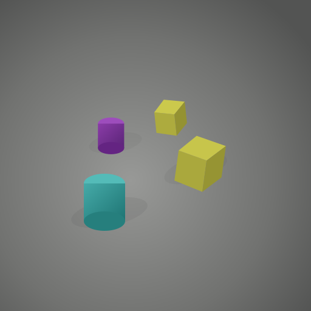
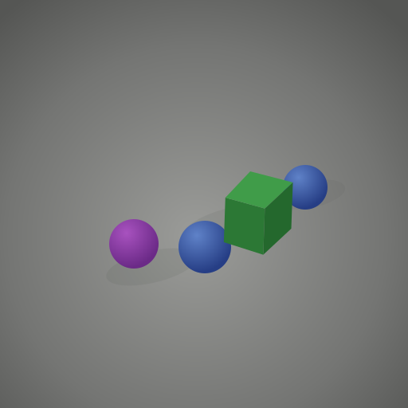

# ITH Deep Learning 2026 Hackathon

Dual-stream PyTorch solution for binary synthetic scene classification, using RGB and gradient ResNet-34 streams with pseudo-labeling, BatchNorm adaptation, test-time augmentation, and probability-space ensembling.


## Project Overview

This project solves the **IITH Deep Learning 2026 Hackathon** binary image classification task. The dataset contains ray-traced synthetic 3D scenes with cubes, spheres, and cylinders under varying colors, sizes, materials, lighting, shadows, and positions.

The key rule discovered from the labelled training set is geometric:

- **Class 0**: the scene does **not** contain both a cube and a sphere together.
- **Class 1**: the scene contains **at least one cube and at least one sphere** together.

## Class Examples

<p align="center">
  
  
</p>

<p align="center">
  <strong>Class 0:</strong> cube+sphere co-occurrence absent &nbsp;&nbsp;|&nbsp;&nbsp;
  <strong>Class 1:</strong> cube and sphere present together
</p>

## Repository Contents

```text
.
├── IITH_Deep Learning.ipynb        # Complete training and inference notebook
├── submission.csv                  # Final prediction file
├── assets/                         # README visual examples
└── README.md                       # Project documentation
```

## Final Approach

The final model is a **dual-stream ResNet-34 ensemble** trained from scratch.

### Visual Stream

- Processes standard RGB images.
- Uses `torchvision.models.resnet34(weights=None)`.
- Applies flips, rotation, color jitter, random grayscale, and MixUp.
- Uses AdamW, OneCycleLR, and Stochastic Weight Averaging.

### Gradient Stream

The second stream converts each image into a 3-channel geometry-focused feature map:

- Canny edges
- Sobel gradient magnitude
- Sobel gradient phase/direction

A bilateral filter is applied before edge extraction to reduce specular-highlight noise while preserving object boundaries.

### Semi-Supervised Refinement

After round-1 training, both streams predict on the unlabeled test set. Samples confidently predicted as negative by both models are added as conservative pseudo-labels:

```text
visual_probability < 0.15 AND gradient_probability < 0.15
```

Both streams are then retrained from scratch on the labelled data plus these negative pseudo-labels.

### Final Inference

The final prediction pipeline uses:

- BatchNorm test-time adaptation on the test distribution
- Four-view TTA: identity, horizontal flip, vertical flip, horizontal+vertical flip
- Probability-space averaging of RGB and gradient stream outputs
- F1-tuned validation threshold

## Dataset Layout

The notebook auto-detects the Kaggle input path and also supports a local folder with this layout:

```text
dataset_root/
├── train/
│   ├── 0/
│   │   └── *.png
│   └── 1/
│       └── *.png
└── test/
    └── *.png
```

Dataset summary from the report:

- Training images: `18,002`
- Class 0 images: `9,001`
- Class 1 images: `9,001`
- Test images: `5,010`

## Requirements

```bash
pip install torch torchvision opencv-python numpy pandas pillow scipy scikit-learn
```

The notebook was designed for a Kaggle GPU environment, where most dependencies are already available.

## How to Run

1. Place the dataset in the expected structure, or run the notebook in the Kaggle competition environment.
2. Open `IITH_Deep Learning.ipynb`.
3. Run all cells in order.
4. The notebook trains both streams, generates pseudo-labels, retrains, tunes the threshold, and writes the submission file.

Default notebook output:

```text
submission_v9.csv
```

This repository also includes:

```text
submission.csv
```

## Results

- Final leaderboard score: `0.813466`
- Model: dual-stream ResNet-34 ensemble
- Ensembling: probability-space averaging
- TTA views: `4`
- Validation split: stratified `85/15`

## Key Lessons

- RGB-only models reached near-perfect validation accuracy but generalized poorly because they learned color and texture shortcuts.
- The true signal is geometric: detecting cube+sphere co-occurrence.
- Gradient features improve robustness to material and lighting changes.
- Probability-space ensembling with F1 threshold tuning is more stable than hard logit thresholding.
- Conservative negative-only pseudo-labeling improves the training set without heavily corrupting labels.

Course: `CS5480: Deep Learning`  
Institution: Indian Institute of Technology Hyderabad
